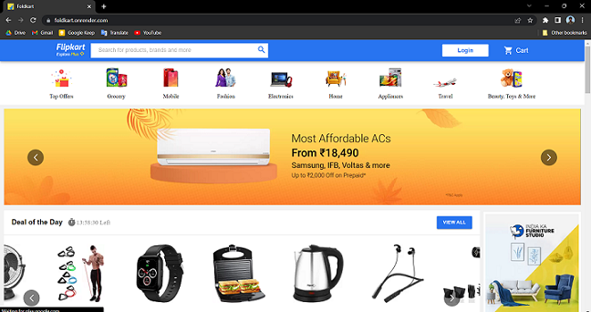

# Foldkart - Flipkart Clone Project

This e-commerce website is developed using MERN Stack.

## Features

- Login / Signup with email, username and password
- Search items
- Explore the items and read the detail of an item
- Add item to the cart and Remove item from the cart
- Place order from an item or from the cart

## Link to the Website

🔗 https://foldkart.onrender.com

📽️ [Highlights - YouTube](https://youtu.be/owG17P4vr4Q)


## Tech

- **Client** : React, Material UI, Redux
- **Server** : Node, Express, Mongoose
- **Database** : MongoDB

## Screenshots




## Installation

- Clone the Repository
- Use below commands for both the folders
	1. ```npm install```
	2. ```npm run start```

## Environment Variables

```DB_USERNAME```
```DB_PASSWORD```
